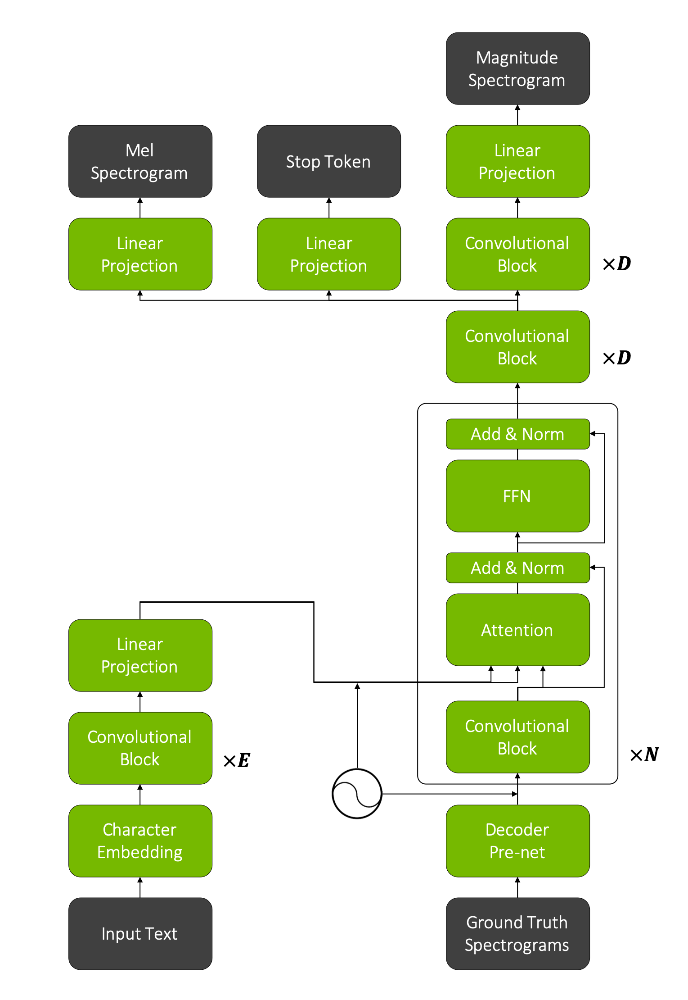
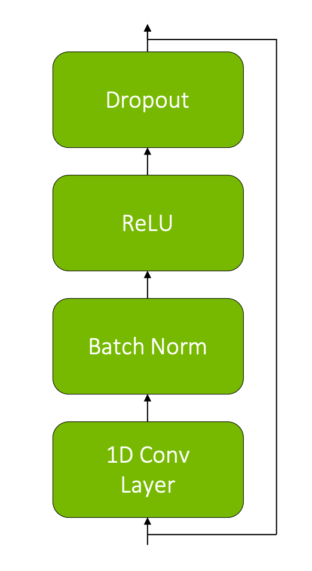

# Transformer-TTS

A Tensorflow Implementation like "Neural Speech Synthesis with
Transformer Network" Port From OpenSeq2Seq

Model
=====

Centaur is hand-designed encoder-decoder model based on the [Neural
Speech Synthesis with Transformer
Network](https://arxiv.org/pdf/1809.08895.pdf) and [Deep Voice3](https://arxiv.org/pdf/1710.07654.pdf) papers.

Encoder
=======

The encoder architecture is simple. It consists of an embedding layer
and a few convolutional blocks followed by a linear projection.

Each convolution block is represented by a convolutional layer followed
by batch normalization and ReLU with dropout and residual connection:

Decoder
=======

The decoder architecture is more complicated. It is comprised of a
pre-net, attention blocks, convolutional blocks, and linear projections.

The pre-net is represented by 2 fully connected layers with ReLU
activation and a final linear projection.

The attention block is similar to the transformer block described in the
[Attention Is All You Need](https://arxiv.org/pdf/1706.03762.pdf) paper,
but the self-attention mechanism was replaced with our convolutional
block and a single attention head is used. The aim of Centaur's
attention block is to learn proper monotonic encoder-decoder attention.
Also we should mention here that we add positional encoding to encoder
and pre-net outputs without any trainable weights.

The next few convolutional blocks followed by two linear projections
predict the mel spectogram and the stop token. Additional convolutional
blocks with linear projection are used to predict the final magnitude
spectogram, which is used by the Griffin-Lim algorithm to generate
speech.

Tips and Tricks
===============

One of the most important tasks of the model is to learn a smooth
monotonic attention. If the alignment is poor, the model can skip or
repeat words, which is undesirable. We can help the model achieve this
goal using two tricks. The first one is to use a reduction factor, which
means to predict multiple frames per time step. The smaller this number
is, the better the voice quality will be. However, monotonic attention
will be more difficult to learn. In our experiments we generate 2 audio
frames per step. The second trick is to force monotonic attention during
inference using a fixed size window.

Audio Samples
=============

Audio samples with the centaur model can be found :
<https://nvidia.github.io/OpenSeq2Seq/html/speech-synthesis/centaur-samples.html>

References
=============
- [Rayhane-mamah/Tacotron2](https://github.com/Rayhane-mamah/Tacotron-2)
- [NVIDIA/OpenSeq2Seq](https://github.com/NVIDIA/OpenSeq2Seq)

# Donating
If you found this project useful, consider buying me a coffee

 
